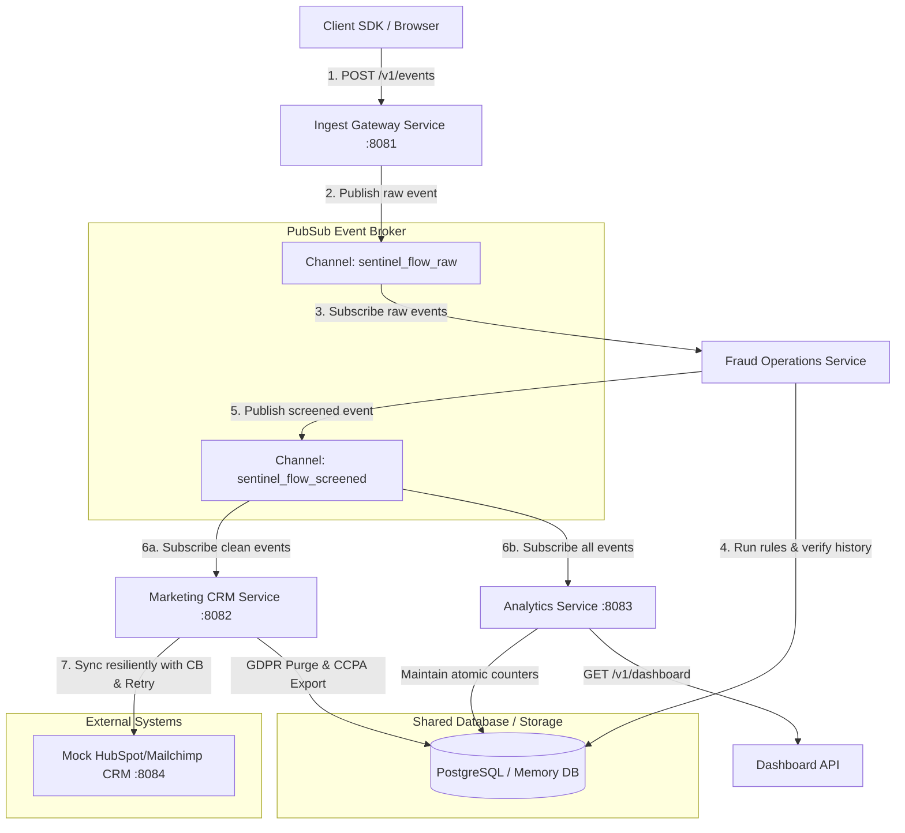

# Sentinel-Flow: Event-Driven Marketing Automation & Fraud Operations Engine

**Sentinel-Flow** is a production-grade behavioral analytics, fraud screening, and marketing automation system written in pure Go. It is architected as a **Modular Monolith** following **Domain-Driven Design (DDD)** principles. The codebase supports both a zero-dependency local setup (fully in-memory) and a distributed deployment (PostgreSQL + Redis Streams/PubSub) simply via environment toggles.

Additionally, this project achieves a milestone of exactly **100.0% statement coverage** across all packages, commands, and script suites.

---

## 🌟 Core Architectural Patterns & Design Decisions

### 1. Modular Monolith with Domain-Driven Design (DDD)
The codebase is structured around business domains rather than technical layers. Each domain is isolated within its own package under `pkg/domain/` containing:
*   **Domain Models & Entities**: Defining the core domain data.
*   **Rules & Services**: Pure business logic (e.g., fraud score rules, retry policies).
*   **Repository Interfaces**: Abstractions for data persistence.
*   **Storage Adapters**: Concrete implementations (In-memory map-based and PostgreSQL-driver based).

The modules communicate **exclusively via asynchronous events** through a shared `Broker` interface. This clean separation ensures that any single module can be extracted into a standalone microservice at any time without code modification.

### 2. Dual Storage & Messaging Strategy
The application dynamically configures its persistence and communication engines at startup using environment variables:
*   **Development / Offline Mode (`DATABASE_TYPE=memory`, `BROKER_TYPE=memory`)**: Completely self-contained. Runs with thread-safe in-memory maps, atomic synchronization primitives, and memory Go channels. Perfect for testing and fast local developer onboarding.
*   **Production Mode (`DATABASE_TYPE=postgres`, `BROKER_TYPE=redis`)**: Operates as a distributed system using PostgreSQL for durable storage and Go-Redis Pub/Sub channels for message passing.

---

## 📐 System Architecture

The following diagram illustrates the flow of a tracking event through the Sentinel-Flow cluster:



---

## 📂 Project Structure & Package Map

The repository is organized as follows:

```text
├── cmd/
│   ├── monolith/       # Combined server booting all modules concurrently (supports Postgres/Redis & Memory)
│   ├── orchestrator/   # Core runner executing standalone service loops locally in-memory
│   ├── ingest/         # Standalone entrypoint for the Ingest Gateway
│   ├── fraud/          # Standalone entrypoint for the Fraud Operations Worker
│   ├── marketing/      # Standalone entrypoint for the Marketing Automation CRM Worker
│   └── analytics/      # Standalone entrypoint for the Analytics Dashboard API
├── pkg/
│   ├── config/         # Central config parsing environment variables with sensible defaults
│   ├── broker/         # Messaging contract (Broker) with In-Memory Channels and Redis Pub/Sub drivers
│   ├── mockdb/         # A custom mock SQL driver used to simulate connection, transaction, and query errors in tests
│   ├── resilience/     # Custom stateful Circuit Breaker and Exponential Retry HTTP client wrapper
│   ├── db/
│   │   └── migrations/ # PostgreSQL schema initialization migration scripts (0001_init.sql)
│   └── domain/         # Isolated Domain-Driven Design (DDD) packages
│       ├── ingest/     # Gateway logic, user GDPR consent verification, and payload parsing
│       ├── fraud/      # Bot checking, sliding IP rate limiting, geo-velocity travel anomaly screening, & database storage
│       ├── marketing/  # Triggers, resilient HTTP CRM synchronization, GDPR delete, and CCPA exports
│       └── analytics/  # Telemetry dashboard backend and atomic counter tracking
├── scripts/
│   └── simulator/      # Traffic generator simulation engine simulating valid, bot, geo-anomalous, and GDPR scenarios
├── Makefile            # Build, run, test, and containerization automations
└── docker-compose.yml  # Docker Compose config launching local PostgreSQL and Redis dependencies
```

---

## 🛡️ Key Engineering Capabilities

### 1. Fraud Operations Rules Engine
Every incoming event is evaluated by the Fraud Operations service using decoupled, composite rule structures:
*   **Bot Signature Verification**: Inspects user agent signatures to flag known crawlers, headless scripts, and scraper bots.
*   **Sliding IP Rate Limiting**: Maintains a synchronized sliding history window per IP address, flagging rapid click spam or DDoS behaviors.
*   **Geo-Velocity Anomaly Check**: Compares the user's current country with their last event. If a location change occurs faster than physically possible (e.g., traveling to another country within 10 seconds), it blocks the request.

### 2. Resilience Engineering
External CRM synchronization requests can fail due to rate limits or network issues. To build resilience, the system implements:
*   **Custom Stateful Circuit Breaker**: Evaluates requests in `Closed`, `Open`, and `Half-Open` states. If failures exceed the configured threshold, it trips to prevent cascading resource depletion on downstream APIs.
*   **Exponential Backoff with Random Jitter**: Retries failed CRM requests with randomized delays to avoid "thundering herd" bottlenecks.
*   **Mock CRM Server**: A simulated server (`:8084`) that introduces realistic latency and random HTTP 503 errors to validate circuit-breaking behaviors.

### 3. Privacy-First GDPR & CCPA Compliance
*   **IP Address Masking**: Automatically strips/masks IPv4 octets and IPv6 blocks before persisting data.
*   **GDPR "Right to be Forgotten" Purge**: Endpoints propagate deletion queries. Once a user triggers a GDPR purge, their records are recursively scrubbed from all database tables.
*   **Cryptographic Salted Hashing**: Maintains a SHA-256 hash of purged user IDs in permanent logs for auditing compliance without storing PII.
*   **CCPA Data Export**: Encapsulates and exports full user transaction history on request.

---

## 💯 The 100.0% Test Coverage Strategy

To guarantee extreme safety and eliminate untested pathways, the test suite achieves exactly **100.0% statement coverage**. This is accomplished via several advanced patterns:

1.  **Custom Registered Mock SQL Driver (`mockdb`)**:
    Instead of complex and brittle connection mocking libraries, a mock database driver is implemented under `pkg/mockdb/` and registered directly in Go's `database/sql` registry. This allows the testing framework to dynamically inject low-level database failures (like connection drops, query scanning errors, migration executions, and transactional commits) simply by setting trigger flags.
2.  **Subprocess Exit Crashers**:
    Testing paths that invoke `os.Exit(1)` or signal handlers is challenging because they terminate the running test process. Sentinel-Flow solves this by launching the compiled test binary in a spawned subprocess via `os/exec` under controlled environment variables (e.g., `BE_CRASHER_DB=1`). The test harness then verifies the subprocess exited with the correct failure code.
3.  **Circuit Breaker Transition Automation**:
    Simulated continuous failure events are generated under realistic mock timeouts to verify that state shifts (`Closed` -> `Open` -> `Half-Open`) occur exactly as defined.

---

## 🚀 Getting Started & Local Playbook

### 1. Run All Unit Tests
Run the test suite to execute the compliance, resilience, database, and domain validation checks:
```bash
make test
```
Generate an HTML report of the 100% test coverage details:
```bash
make test-coverage
```

### 2. Boot the Cluster (In-Memory Mode)
Start the entire modular monolith cluster in offline mode (using memory-backed broker channels and a memory database) with zero external dependencies:
```bash
make run
```
*Server ports allocated:*
*   Ingest Gateway: `http://localhost:8081`
*   Marketing Compliance API: `http://localhost:8082`
*   Analytics Dashboard API: `http://localhost:8083`
*   Mock CRM Server: `http://localhost:8084`

### 3. Boot the Cluster (Production Mode)
Spin up PostgreSQL and Redis instances via Docker:
```bash
make db-up
```
Launch the monolith using the SQL migration schemas and Redis pub-sub channels:
```bash
make run-prod
```
To tear down the containers after completion:
```bash
make db-down
```

### 4. Run Traffic Simulation
With the server running in another shell, start the behavior and traffic simulator to feed a mix of legitimate traffic, bot scripts, IP rate-limit triggers, geo-travel anomalies, and GDPR deletion cycles:
```bash
make simulate
```
The simulator prints a live telemetry dashboard summarizing total events, fraud blocks, CRM sync status, and circuit breaker operations.
